# ⚡ F.R.I.D.A.Y 2.0 — Autonomous Cyberpunk AI Super-Agent

<p align="center">
  
</p>

<p align="center">
  <a href="#-system-architecture"></a>
  <a href="#-key-super-agent-capabilities"></a>
  <a href="#-speech-interruption-system"></a>
  <a href="#-memory--vector-rag"></a>
  <a href="#-installation--quick-start"></a>
  <a href="#-complete-tool-arsenal-40-tools"></a>
</p>

---

> 🚀 **F.R.I.D.A.Y** (_Friendly Reliable Intelligent Digital Assistant for Youth_) is an **Iron Man-class Autonomous Desktop & Multimodal Super-Agent** built in Python. Designed to run as an intelligent continuous background daemon, a live real-time computer vision stream, and a rich cyberpunk terminal HUD, F.R.I.D.A.Y delivers **Multimodal Live Vision & Speech**, **Real-Time Function Calling**, **Instant Speech Interruption**, **Isolated Python Code Sandboxing**, **Proactive Morning Briefings**, **Autonomous Sub-Agents**, and **ChromaDB Vector RAG Long-Term Memory**.

---

```
╔══════════════════════════════════════════════════════════════════════════════════╗
║   ███████╗██████╗ ██╗██████╗  █████╗ ██╗   ██╗                                   ║
║   ██╔════╝██╔══██╗██║██╔══██╗██╔══██╗╚██╗ ██╔╝                                   ║
║   █████╗  ██████╔╝██║██║  ██║███████║ ╚████╔╝                                    ║
║   ██╔══╝  ██╔══██╗██║██║  ██║██╔══██║  ╚██╔╝                                     ║
║   ██║     ██║  ██║██║██████╔╝██║  ██║   ██║                                      ║
║   ╚═╝     ╚═╝  ╚═╝╚═╝╚═════╝ ╚═╝  ╚═╝   ╚═╝                                      ║
║                                                                                  ║
║   ⚡ Friendly Reliable Intelligent Digital Assistant — v4.2 SUPER-AGENT HUD ⚡    ║
╚══════════════════════════════════════════════════════════════════════════════════╝
```

---

## 📑 Table of Contents

- [✨ Key Super-Agent Capabilities](#-key-super-agent-capabilities)
  - [👁️ 1. Multimodal Live Screen & Webcam Vision (`Live_mode.py`)](#️-1-multimodal-live-screen--webcam-vision-live_modepy)
  - [⏹️ 2. Real-Time Speech Interruption (`Ctrl + D` / `Esc`)](#️-2-real-time-speech-interruption-ctrl--d--esc)
  - [🧠 3. Dual-Tier Memory System (Episodic & Vector ChromaDB RAG)](#-3-dual-tier-memory-system-episodic--vector-chromadb-rag)
  - [🐕 4. Proactive Background Watchdog Daemon (`daemon.py`)](#-4-proactive-background-watchdog-daemon-daemonpy)
  - [🤖 5. Autonomous Sub-Agents (Researcher & Code Reviewer)](#-5-autonomous-sub-agents-researcher--code-reviewer)
  - [🐍 6. Python Code Execution Sandbox](#-6-python-code-execution-sandbox)
  - [🛡️ 7. Triple-Tier ACL Security & Tool Guard (`Tool_guard.py`)](#️-7-triple-tier-acl-security--tool-guard-tool_guardpy)
  - [📱 8. Mobile Automation via ADB](#-8-mobile-automation-via-adb)
- [🏛️ System Architecture](#-system-architecture)
- [🎮 CLI Command Palette & Shortcuts](#-cli-command-palette--shortcuts)
- [🛠️ Complete Tool Arsenal (40+ Tools)](#️-complete-tool-arsenal-40-tools)
- [💻 Installation & Quick Start](#-installation--quick-start)
- [⚙️ Configuration & Key Vault](#️-configuration--key-vault)
- [🧑‍💻 Developer & Credits](#-developer--credits)

---

## ✨ Key Super-Agent Capabilities

### 👁️ 1. Multimodal Live Screen & Webcam Vision (`Live_mode.py`)

F.R.I.D.A.Y features a **Real-Time Multimodal Streaming Engine** powered by Google's `gemini-2.5-flash-native-audio-preview` model over WebSockets:

- **Bidirectional Neural Audio**: Real-time natural speech conversation with low latency using Google's **Zephyr** neural voice.
- **Dynamic Visual Perception**: Streams desktop screen or real-time webcam feeds at crisp, lightweight 640x480 resolution (zero buffer lag).
- **25+ Live In-Stream Tool Calls**: During live voice/video streaming, F.R.I.D.A.Y can dynamically execute desktop actions (change volume, adjust brightness, launch applications, take screenshots, check battery, search Google) and confirm the outcome in live spoken voice!

```bash
# Launch Live Screen Vision
python Live_mode.py --mode screen

# Launch Live Webcam Vision
python Live_mode.py --mode camera
```

---

### ⏹️ 2. Real-Time Speech Interruption (`Ctrl + D` / `Esc`)

Never wait for long AI responses again! When F.R.I.D.A.Y is reading out a long response, the user has full instantaneous control:

- **Instant Cutoff (<30ms)**: Press **`Ctrl + D`**, **`Esc`**, or **`q`** to immediately halt PyGame audio playback.
- **Pipeline Cancellation**: Cancels further TTS audio generation in background worker threads and purges audio queues.
- **Clean Input Return**: Automatically flushes the terminal keystroke buffer and immediately returns the cursor to `👤 You: ` for the next command!

---

### 🧠 3. Dual-Tier Memory System (Episodic & Vector ChromaDB RAG)

F.R.I.D.A.Y remembers everything across sessions:

- **Episodic Session Memory**: Stores structured conversation summaries, extracted user preferences, and task context.
- **Vector RAG Long-Term Memory (`ChromaDB`)**: Embeds user notes, preferences, facts, and conversation milestones using high-dimensional vector representations.
- **Proactive Memory Recall**: Surfaces relevant historical context and previous projects automatically during conversation.

---

### 🐕 4. Proactive Background Watchdog Daemon (`daemon.py`)

F.R.I.D.A.Y is more than a passive chatbot — she watches your system around the clock:

- **Morning Briefing Protocol**: Automatically synthesizes local weather, battery status, top news headlines, and scheduled reminders into spoken audio and **Windows Native Desktop Toast Notifications**.
- **Reminder Watchdog**: Monitors scheduled tasks and triggers real-time desktop popups when alerts fall due.
- **System Health Monitor**: Alerts on low battery (<30%) and excessive CPU spikes.

---

### 🤖 5. Autonomous Sub-Agents (Researcher & Code Reviewer)

When tasks require deep multi-step thinking, F.R.I.D.A.Y dispatches dedicated autonomous sub-agents:

| Sub-Agent | Capability |
| :--- | :--- |
| 🌐 **Deep Research Agent** | Formulates multi-angle search queries, scrapes web pages, evaluates sources, and synthesizes structured research dossiers. |
| 💻 **Code Reviewer Agent** | Scans Python/JS/C++ files, identifies syntax bugs, calculates complexity, and proposes secure, optimized refactorings. |

---

### 🐍 6. Python Code Execution Sandbox

- **Isolated Process Runner (`run_python_code`)**: Executes code in an isolated subprocess with stdout/stderr capture and a strict 15-second timeout.
- **Use Cases**: Solving complex mathematics, analyzing local CSV/JSON datasets, plotting charts, or automating file conversions.

---

### 🛡️ 7. Triple-Tier ACL Security & Tool Guard (`Tool_guard.py`)

Enterprise-grade Access Control Lists (ACL) prevent unauthorized tool execution across different endpoints:

- **`SERVER` Mode**: Full access to all 40+ system tools, file system, code interpreter, and sub-agents.
- **`MOBILE` Mode**: Whitelisted for communication (WhatsApp, phone calls), tasks, reminders, web search, and weather.
- **`WEB` Mode**: Restricted to safe, read-only utilities and public search APIs.

---

### 📱 8. Mobile Automation via ADB

Connect your Android smartphone wirelessly or via USB:

- **`unlock_device`**: Automatically sends unlock key events.
- **`send_whatsapp_message`**: Automates WhatsApp dispatch to any contact.
- **`phone_call_with_mobile`**: Triggers direct outgoing cellular calls.

---

## 🏛️ System Architecture

The following diagram illustrates F.R.I.D.A.Y's modular architecture — from user sensory inputs and real-time interruption handling to the multi-agent brain, tool execution layer, and background daemon:

```mermaid
flowchart TB
    %% Styling Classes
    classDef inputLayer fill:#0f172a,stroke:#00f2fe,stroke-width:2px,color:#fff;
    classDef coreLayer fill:#1e1b4b,stroke:#a855f7,stroke-width:2px,color:#fff;
    classDef brainLayer fill:#172554,stroke:#3b82f6,stroke-width:2px,color:#fff;
    classDef toolLayer fill:#064e3b,stroke:#10b981,stroke-width:2px,color:#fff;
    classDef memoryLayer fill:#451a03,stroke:#f59e0b,stroke-width:2px,color:#fff;
    classDef outputLayer fill:#4c0519,stroke:#f43f5e,stroke-width:2px,color:#fff;

    %% Subgraph: Inputs & Sensory
    subgraph SENSORY_INPUTS["🌐 SENSORY INPUT & CONTROL LAYER"]
        U_KEY["⌨️ Keyboard Input (Terminal HUD)"]:::inputLayer
        U_MIC["🎙️ Microphone PCM Audio (16kHz)"]:::inputLayer
        U_CAM["📷 Webcam / Screen Stream (640x480)"]:::inputLayer
        U_WAKE["⚡ Background Wake-Word Listener ('Friday')"]:::inputLayer
        U_INT["⏹️ Real-Time Interruption (Ctrl+D / Esc)"]:::inputLayer
    end

    %% Subgraph: Main Loop Orchestration
    subgraph ORCHESTRATION["⚡ RUNTIME ORCHESTRATION ENGINES"]
        CLI["🖥️ FridayCLI Controller (Rich HUD & Palette)"]:::coreLayer
        LIVE["👁️ Multimodal Live Engine (Live_mode.py)"]:::coreLayer
        DAEMON["🐕 Watchdog Daemon (daemon.py - Background)"]:::coreLayer
        SPEAK["🔊 Interruptible Audio Engine (speak.py)"]:::coreLayer
    end

    %% Subgraph: Cognitive Brain & Reasoning
    subgraph BRAIN["🧠 COGNITIVE BRAIN & LLM REASONING"]
        ROUTER["🔀 Intent Classifier & Tool Planner"]:::brainLayer
        GEMINI_LIVE["⚡ Google Gemini 2.5 Flash Live API (WebSocket)"]:::brainLayer
        PRIMARY_LLM["🤖 OpenAI / Groq / Ollama Neural Providers"]:::brainLayer
        SUB_RESEARCH["🌐 Deep Research Sub-Agent"]:::brainLayer
        SUB_CODE["💻 Code Reviewer Sub-Agent"]:::brainLayer
    end

    %% Subgraph: Memory & Knowledge
    subgraph MEMORY["💾 DUAL-TIER KNOWLEDGE & MEMORY SYSTEM"]
        CHROMA["🧠 ChromaDB Vector RAG (Semantic Memory)"]:::memoryLayer
        EPISODIC["📜 Episodic Memory & User Profile JSON"]:::memoryLayer
        REMINDERS["⏰ Reminders & To-Do Task Storage"]:::memoryLayer
    end

    %% Subgraph: Tool Guard & Execution
    subgraph TOOLS["🛠️ SECURITY GUARD & TOOL ARSENAL (40+ TOOLS)"]
        GUARD["🔐 Tool Guard ACL (Server / Mobile / Web)"]:::toolLayer
        SYS_TOOLS["💻 System Controls (Volume, Brightness, Apps, Battery)"]:::toolLayer
        VISION_TOOL["📸 Screen Perception (analyze_screen)"]:::toolLayer
        CODE_TOOL["🐍 Python Code Execution Sandbox"]:::toolLayer
        MOBILE_TOOL["📱 Android ADB Mobile Automation"]:::toolLayer
        WEB_TOOL["🌐 Web Autopilot Scraper & Google Search"]:::toolLayer
    end

    %% Subgraph: Outputs
    subgraph OUTPUTS["📢 ACTUATION & OUTPUT CHANNELS"]
        TTS["🔊 PyGame Audio Playback (gTTS / Zephyr)"]:::outputLayer
        HUD_OUT["📟 Rich Terminal HUD Stream"]:::outputLayer
        TOAST["🔔 Windows Desktop Toast Notifications"]:::outputLayer
        PHONE_OUT["📞 Mobile Cellular Call / WhatsApp"]:::outputLayer
    end

    %% Flow Connections
    U_KEY --> CLI
    U_MIC --> CLI
    U_WAKE --> CLI
    U_MIC --> LIVE
    U_CAM --> LIVE
    U_INT -.->|Interrupt Signal <30ms| SPEAK

    CLI <--> ROUTER
    LIVE <--> GEMINI_LIVE
    DAEMON -->|Proactive Alerts| ROUTER
    DAEMON -->|Alert Event| TOAST

    ROUTER <--> PRIMARY_LLM
    ROUTER <--> CHROMA
    ROUTER <--> EPISODIC
    ROUTER --> SUB_RESEARCH
    ROUTER --> SUB_CODE

    ROUTER --> GUARD
    GEMINI_LIVE -->|Live Function Call| GUARD

    GUARD --> SYS_TOOLS
    GUARD --> VISION_TOOL
    GUARD --> CODE_TOOL
    GUARD --> MOBILE_TOOL
    GUARD --> WEB_TOOL
    GUARD --> REMINDERS

    ROUTER --> SPEAK
    SPEAK --> TTS
    CLI --> HUD_OUT
    MOBILE_TOOL --> PHONE_OUT
    LIVE --> TTS
```



---

## 🎮 CLI Command Palette & Shortcuts

| Command | Shortcut | Functionality |
| :--- | :---: | :--- |
| **`/live`** | — | Activate Multimodal Real-Time Screen & Audio Mode |
| **`/vision`** | — | Activate Real-Time Webcam / Screen Vision Mode |
| **`/voice`** | — | Toggle Continuous Voice Listening Mode (`SpeechRecognition`) |
| **`/type`** | — | Switch to Standard Terminal Typing Mode |
| **`/audio`** | — | Toggle Audio Speech Feedback ON/OFF |
| **`/wakeword`** | — | Enable Hands-Free Background `"Friday"` Wake-Word Detection |
| **`/briefing`** | — | Trigger Proactive Voice & Desktop Morning Briefing |
| **`/status`** | — | Display System Health HUD (CPU %, Battery, ChromaDB, Daemon Logs) |
| **`/reminders`** | — | Display Active and Pending Scheduled Reminders |
| **`/config`** | — | Launch Dynamic Configuration Editor Wizard |
| **`/clear`** | — | Clear Terminal Screen and Re-render Cyberpunk HUD |
| **`/exit`** | `Ctrl + C` | Clean Shutdown of Agent, Watchdog Daemon, and Background Listeners |
| **Instant Stop** | **`Ctrl + D` / `Esc`** | **Interrupt and silence speech output in real-time (<30ms)** |

---

## 🛠️ Complete Tool Arsenal (40+ Tools)

```
├── 📸 Vision & Screen
│   ├── analyze_screen                 # Instant desktop screen snapshot + AI analysis
│   ├── start_live_vision              # Continuous live visual streaming
│   └── capture_screenshot             # Save high-res screenshot to disk
│
├── 🐍 Code Execution & Development
│   ├── run_python_code                # Isolated Python sandbox runner with 15s timeout
│   ├── code_reviewer_agent            # Autonomous codebase reviewer & refactorer
│   └── deep_research_agent            # Multi-step web research & synthesis sub-agent
│
├── 💻 Desktop & Hardware Control
│   ├── volume_up / volume_down        # Master audio endpoint volume adjustments
│   ├── mute_volume / unmute_volume    # Audio mute toggle
│   ├── brightness_up / brightness_down# Monitor hardware brightness control
│   ├── check_battery                  # Battery percentage, charging status & health
│   ├── check_cpu                      # CPU usage %, core frequency & thread load
│   ├── open_app / close_app           # Windows application launcher & process killer
│   ├── minimize / maximize_window     # Active window state controls
│   └── clear_recycle_bin              # Silent Windows recycle bin purging
│
├── 🌐 Web & Information
│   ├── google_search                  # Real-time search query execution
│   ├── extract_webpage_content        # Dynamic web scraper & article extractor
│   ├── summrize_url                   # URL summarization & insight extraction
│   ├── search_wikipedia               # Wikipedia knowledge retrieval
│   └── get_weather                    # Live meteorological reports by city
│
├── 🧠 Memory & Knowledge
│   ├── save_longterm_memory           # Vector insertion into ChromaDB collection
│   ├── search_vector_memory           # High-dimensional semantic recall
│   └── get_proactive_memories         # Temporal memory association extraction
│
├── ⏰ Tasks & Productivity
│   ├── add_reminder / list_reminders  # Natural language reminder scheduling
│   ├── delete_reminder_by_name        # Reminder cancellation
│   ├── add_task / list_tasks          # To-do task creation and inspection
│   └── complete_task / delete_task    # Task state resolution
│
├── 📁 File System Automation
│   ├── create_and_open_file           # File generator and launcher
│   ├── read_file / update_file        # File content reader and editor
│   ├── delete_file / rename_file      # File deletion and renaming
│   └── search_file_in_folder          # Recursive directory pattern search
│
└── 📱 Mobile Device Automation (ADB)
    ├── connect_mobile_with_bat        # Wireless / USB ADB handshake
    ├── unlock_device                  # Remote device wake and unlock
    ├── send_whatsapp_message          # Automated WhatsApp message delivery
    └── phone_call_with_mobile         # Outgoing cellular phone call initiation
```

---

## 💻 Installation & Quick Start

### 1. Prerequisites

- **Python 3.10+** (Tested on Python 3.10, 3.11, 3.12)
- **Windows 10 / 11** (Full feature set) or **Linux / macOS** (Core agent & Live vision)
- Microphone & Speakers / Headphones

### 2. Clone Repository & Setup Virtual Environment

```bash
git clone https://github.com/Shubhampanchal108/F.R.I.D.A.Y-2.0.git
cd F.R.I.D.A.Y

# Create virtual environment
python -m venv .venv

# Activate on Windows (PowerShell / Command Prompt)
.\.venv\Scripts\activate

# Activate on Linux / macOS
source .venv/bin/activate
```

### 3. Install Dependencies

```bash
pip install -r requirements.txt
```

### 4. Launch F.R.I.D.A.Y

```bash
python index.py
```

> 💡 **First-Time Setup**: If running for the first time, F.R.I.D.A.Y automatically launches the **Interactive Setup Wizard** in the terminal to configure your preferred LLM provider, API keys, and voice settings.

---

## ⚙️ Configuration & Key Vault

F.R.I.D.A.Y supports multiple LLM backends:

- **Google Gemini** (Gemini 2.5 Flash, Multimodal Live API, Native Audio)
- **Groq Cloud** (Ultra-fast Llama-3.3-70B, Mixtral)
- **OpenAI** (GPT-4o, GPT-4o-mini)
- **Local Ollama** (DeepSeek-R1, Llama-3.2, Qwen)

Keys are safely stored locally in `config.json` with masked privacy. You can modify keys at any time via:

```bash
# Inside F.R.I.D.A.Y HUD
/config
```

---

## 🧑‍💻 Developer & Credits

**Shubham Panchal** — _Computer Science Engineering Student, Full-Stack & AI/ML Systems Developer_

- 🌐 **Portfolio**: [shubhamportfolio3.netlify.app](https://shubhamportfolio3.netlify.app/)
- 💻 **GitHub**: [@Shubhampanchal108](https://github.com/Shubhampanchal108)
- 🔗 **LinkedIn**: [Shubham Panchal](https://www.linkedin.com/in/shubham-panchal-a80053306)

---

## 🌟 Philosophy

> _"Technology is at its best when it feels like magic. F.R.I.D.A.Y was built not just to respond to prompts, but to stand beside you as an intelligent, autonomous partner."_ 🚀🤖
